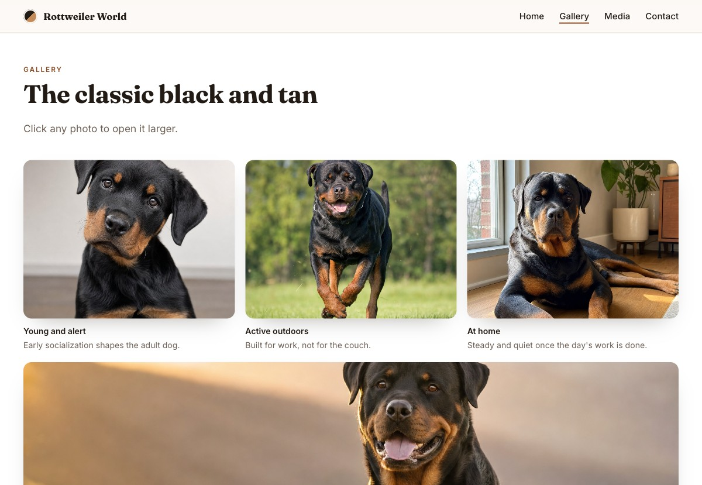

# Rottweiler World

A responsive one-page site about the Rottweiler breed, built with semantic HTML, CSS Grid, Flexbox and vanilla JavaScript. No framework and no build step.



**Live site:** https://reynaldonikola.github.io/rottweiler-responsive-website/

## What it does

- Full-bleed hero with a slow zoom on load and a layered gradient for text contrast
- Sticky header that gains a border on scroll, with a nav link that tracks the section on screen
- Stat counters that animate once, the first time the band enters the viewport
- Sections that fade and rise into place through `IntersectionObserver`
- Gallery with hover zoom and a keyboard-accessible lightbox that closes with Escape
- Responsive video embed that keeps its 16:9 ratio at any width
- Light and dark themes from `prefers-color-scheme`
- Every animation turns off under `prefers-reduced-motion`

## Built with

HTML5, CSS custom properties, CSS Grid, Flexbox, `IntersectionObserver`, `requestAnimationFrame`.

## Structure

```
index.html
css/main.css
js/main.js
images/
```

## Running it

Any static server works:

```bash
python3 -m http.server 8000
```

Then open http://localhost:8000.

## Credits

Photography generated for this project. Built by Reynaldo Moros as coursework at Utah Valley University.
